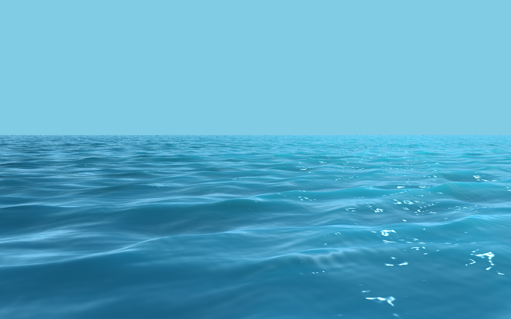
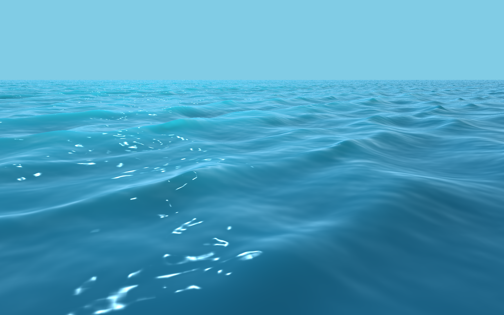

## 真实感海面渲染

### 依赖
- 使用C++11, Qt, OpenGL, GLSL
- 使用qmake构建

### 特性
- 使用Qt实现的FPS相机，可以在场景中自由移动
- 使用一种跟随摄像机移动的动态LOD方案
- 使用一种Gerstner波的改进方法对海浪进行模拟，相比Gerstner波有更好的可控性
- 使用法线贴图，对不同方向的动态UV插值混合实现水面的流动效果
- 使用光栅化方法着色，Blinn-Phong光照模型、菲涅尔反射、使用近似方法计算次表面散射

### 效果展示

